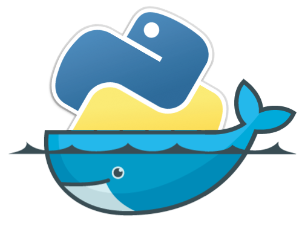

<!-- PROJECT LOGO -->
<br />
<div align="center">
  <a href="https://github.com/richardlwebb/local_python/issues">
    
  </a>

  <h3 align="center">Local Python</h3>

  <p align="center">
    An in house build for Python containers
    <br />
    <br />
    ·
    <a href="https://github.com/richardlwebb/local_python/issues">Report Bug</a>
    ·
    <a href="https://github.com/richardlwebb/local_python/issues">Request Feature</a>
  </p>
</div>

<!-- TABLE OF CONTENTS -->
<details>
  <summary>Table of Contents</summary>
  <ol>
    <li>
      <a href="#getting-started">Getting Started</a>
      <ul>
        <li><a href="#prerequisites">Prerequisites</a></li>
        <li><a href="#installation">Installation</a></li>
      </ul>
    </li>
    <li><a href="#acknowledgments">Acknowledgments</a></li>
  </ol>
</details>

<!-- GETTING STARTED -->
## Getting Started

### Prerequisites
* Install Reqired packages 
  ```sh
  apt install -y jq gawk
  ```

### Installation

The steps bellow will generate Dockerfiles for all the supported builds.

```sh
./update.sh   
```

If you encounter any errors you can run each script individually

1. Clone the repo
   ```sh
   git clone https://github.com/richardlwebb/local_python.git
   ```
3. Run versions script
   ```sh
   ./versions.sh
   ```
4. Run Apply Templates script
   ```sh
   ./apply-templates.sh
   ```

<p align="right">(<a href="#readme-top">back to top</a>)</p>

<!-- ACKNOWLEDGMENTS -->
## Acknowledgments

* [Official Upstream Python Repository](https://github.com/docker-library/python)
