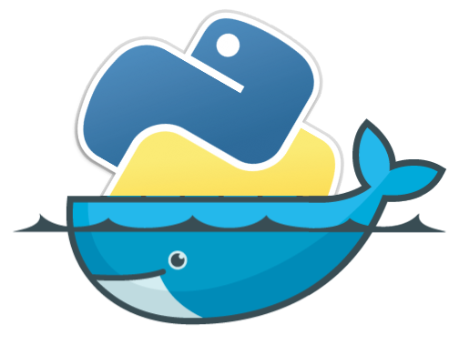

<!-- PROJECT LOGO -->
<br />
<div align="center">
  <a href="https://github.com/richardlwebb/local_python/issues">
    
  </a>

  <h3 align="center">Local Python</h3>

  <p align="center">
    An in house build for Python containers
    <br />
    <br />
    ·
    <a href="https://github.com/richardlwebb/local_python/issues">Report Bug</a>
    ·
    <a href="https://github.com/richardlwebb/local_python/issues">Request Feature</a>
  </p>
</div>

<!-- TABLE OF CONTENTS -->
<details>
  <summary>Table of Contents</summary>
  <ol>
    <li>
      <a href="#about-the-project">About The Project</a>
      <ul>
        <li><a href="#built-with">Built With</a></li>
      </ul>
    </li>
    <li>
      <a href="#getting-started">Getting Started</a>
      <ul>
        <li><a href="#prerequisites">Prerequisites</a></li>
        <li><a href="#installation">Installation</a></li>
      </ul>
    </li>
    <li><a href="#usage">Usage</a></li>
    <li><a href="#acknowledgments">Acknowledgments</a></li>
  </ol>
</details>

<!-- GETTING STARTED -->
## Getting Started

### Prerequisites
* Install Reqired packages 
  ```sh
  apt install -y jq gawk
  ```


<!-- ACKNOWLEDGMENTS -->
## Acknowledgments

* [Official Upstream Python Repository](https://github.com/docker-library/python)
